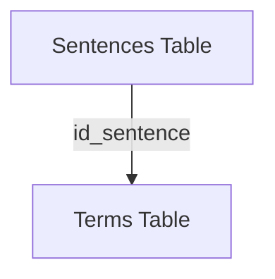
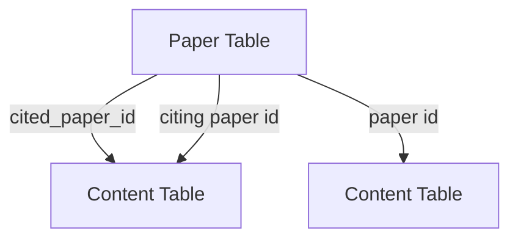
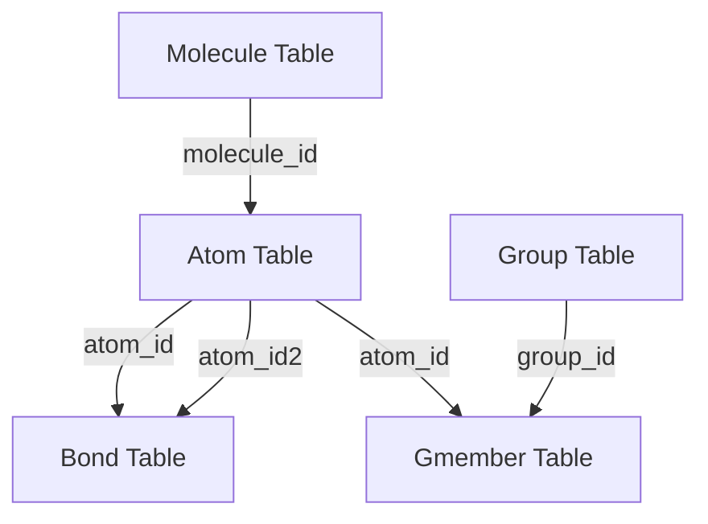
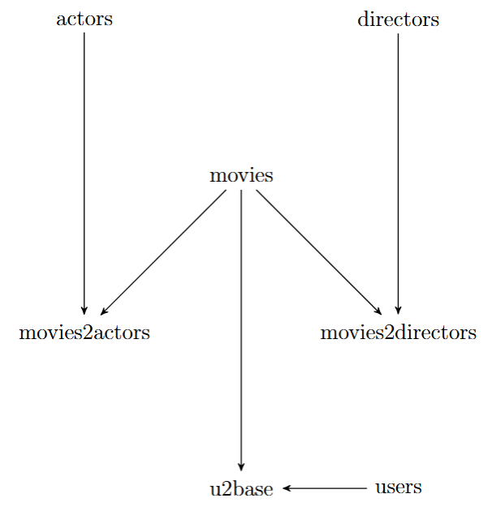

# SD-ED

# Synthetic Relational Datasets using Euclidean Distance

## Overview

This project generates synthetic data for relational datasets using the concept of extended tables and Euclidean distance to connect related records. The synthetic data generation process is powered by the `synthpop` library, which creates synthetic data for individual extended tables.

## Features

- Utilizes **extended tables** to represent individual tables.
- Uses **synthpop** to generate synthetic data for each extended table independently.
- Applies **Euclidean distance** to establish relationships between records.
- Provides example implementations for the following datasets:
  - `DCG_v1`
  - `CORA_v1`
  - `Biodegradability_v1`
  - `imdb_MovieLens_v1`

## Dataset Structure

Each dataset folder contains the following subdirectories:

- `data/` - Contains the original dataset.
- `metadata/` - Stores metadata information for the dataset.
- `relationship/` - Defines the relationships between different tables.
- `ed_data/` - Contains the generated synthetic data for SRD-ED method.
- `evaluation/` - Contains the evaluation of the two methods. Because these methods are not entirely deterministic, you may see slight variations in the results if you rerun the code.

The information about `data`, `metadata`, and `relationship` is sourced from datasets obtained via the **SDV library**.

## Requirements

The project contains two files: `Synthethic_data.py` and `Compare_data.py`.

- `Synthethic_data.py` generates synthetic data for a selected dataset using the `synthpop` library, which runs properly in Python 3.8. It also requires the dependencies listed in the `requirements.txt` file.
- `Compare_data.py` evaluates the synthetic data using metrics from the `sdv` library, which requires Python 3.12.

Since each script requires a different Python environment, ensure that you have two separate virtual environments before running the scripts:

- One environment for Python 3.8 (for `Synthethic_data.py`).
- Another environment for Python 3.12 (for `Compare_data.py`).

### `Synthethic_data.py`

- Requires Python 3.8
- Dependencies are specified in `requirements.txt`

#### Details

This script generates **synthetic data** using the **SD-ED** method. It first **extends** the tables, then uses the **synthpop** package to create synthetic data for each extended table. Next, it applies **Euclidean distance** to connect the tables.

##### Important Notes

- **Real data location**: The real data must be stored in the `data` subfolder, with each table in a CSV file.
- **Relationships**: Relationship information should be stored in the `relationship` folder.
- **Output**: Once the process finishes, the synthetic data will be placed in the `ed_data` folder.

> **Tip**: Make sure you create the `ed_data` folder before running the code.

#### Installation

```bash
pip install -r requirements.txt
```

> ⚠ **Important Notice: Synthpop Library Discontinuation**
> The Synthpop library has been discontinued. While it is still available via `pip install Synthpop`, the current version does not contain the necessary methods used in this project.
>
> To ensure compatibility, we provide an archived version of Synthpop in the `libraries/Synthpop.rar` file.

##### Additional Steps:

2. Extract the `Synthpop.rar` file from `libraries/`.
3. Locate your environment folder, then navigate to:
   ```
   <your_env>/lib/site-packages/
   ```
4. Copy the extracted contents of `Synthpop` into the `site-packages` folder, replacing any existing files.

#### Running the Code

Execute the script to generate synthetic data:

```bash
python Synthethic_data.py
```

---

### `Compare_data.py`

- Requires Python 3.12
- Only requires the `sdv` library

#### Details

This script evaluates synthetic data using diagnostic and quality metrics from the **SDV** library. It reads the synthetic data stored in the `ed_data` folder, generates additional synthetic data using the **HMA** method, and then saves the evaluation results for both methods in the `evaluation` folder.

- **ED**: Corresponds to the evaluation of the **SD-ED** method.
- **HMA**: Corresponds to the evaluation of the **HMA** method.

This script uses the **sdv** library, so please ensure it is properly installed before running.

#### Installation

```bash
pip install sdv
```

#### Running the Code

Execute the script to evaluate synthetic data:

```bash
python Compare_data.py
```

## Limitations

The project currently supports numerical and categorical columns. The primary and foreign keys should be single columns. It does not handle null values, so it would be helpful to replace them, using a random number for numerical columns or a new category for categorical columns.

## Datasets

There are four datasets available from the SDV library, with a brief explanation of each provided below.

### `DCG_v1`

The `DCG_v1` dataset consists of two tables, Sentences and Terms

#### Relationship Diagram



### `CORA_v1`

The `CORA_v1` dataset consists of multiple tables connected by relational links representing paper citations and content relationships.

#### Relationship Diagram



### `Biodegradability_v1`

The `Biodegradability_v1` dataset consists of multiple tables representing molecules, atoms, bonds, and groups.

#### Relationship Diagram



### `imdb_MovieLens_v1`

The `imdb_MovieLens_v1` dataset consists of multiple tables connecting movies, actors, directors, users, and their interactions.

#### Relationship Diagram


